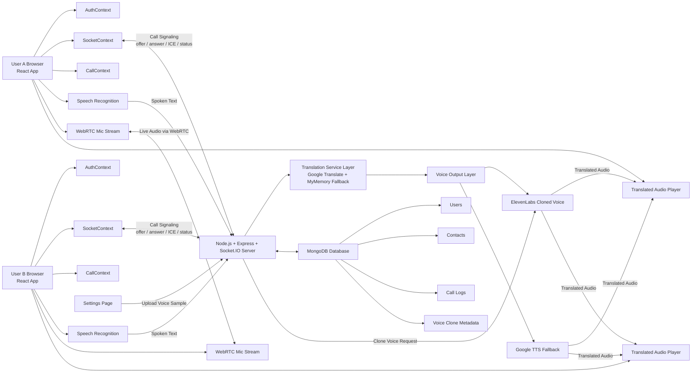
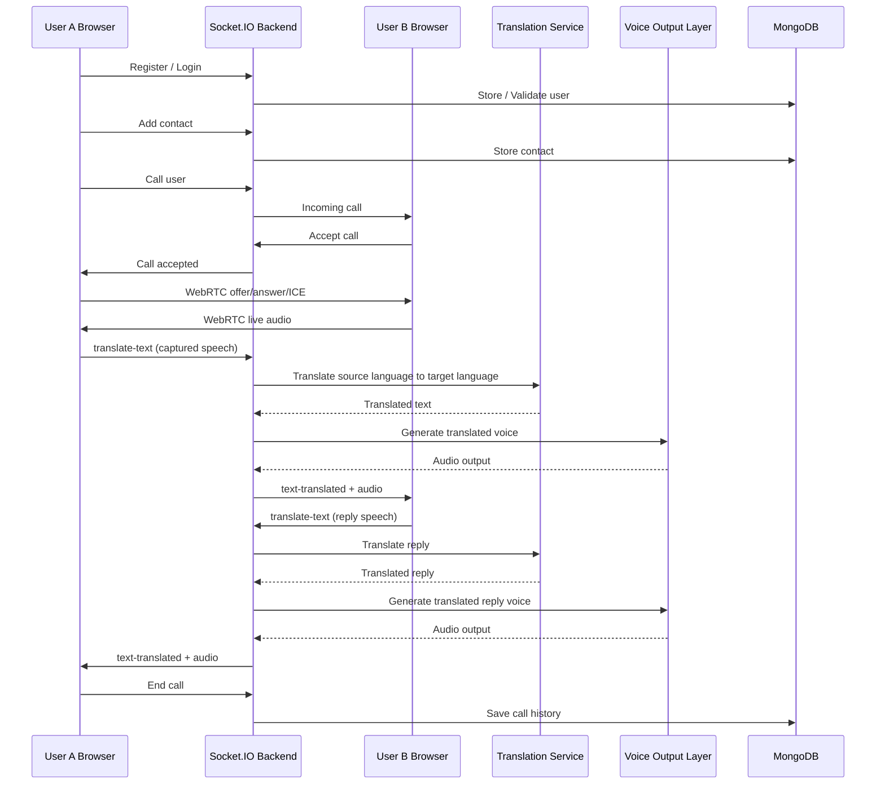

# VoiceTranslationCallingApp Architecture Diagram Package

Use the Mermaid code below directly in ChatGPT, Claude, Notion, Mermaid Live, or any diagram-capable tool.

## 1. Mermaid End-to-End Architecture Diagram



## 2. Mermaid Sequence Diagram



## 3. High-Quality Prompt For ChatGPT Diagram Rendering

Paste the prompt below into ChatGPT if you want it to create a more artistic or presentation-style architecture diagram:

```text
Create a polished end-to-end system architecture diagram for a project called VoiceTranslationCallingApp.

The diagram should show two browser clients, User A and User B, both running a React frontend. Each client contains AuthContext, SocketContext, CallContext, browser Speech Recognition, WebRTC microphone/audio stream, and a translated audio playback layer.

Show a direct peer-to-peer WebRTC connection between User A and User B for live voice audio.

Show both clients connected to a Node.js + Express + Socket.IO backend. The backend is responsible for user authentication, contact management, call signaling, translation events, voice routing, and call history logging.

From the backend, show a translation service layer that uses Google Translate as the primary engine and MyMemory as fallback.

After translation, show a voice output layer with two branches:
1. ElevenLabs cloned voice for personalized translated output
2. Google TTS fallback when cloned voice is unavailable

Show a MongoDB database connected to the backend with four main collections or data groups:
- Users
- Contacts
- Call Logs
- Voice Clone Metadata

Also show a Settings / Voice Clone upload flow from the client to the backend and from the backend to ElevenLabs for voice cloning.

The final diagram should look clean, modern, professional, startup-grade, and presentation-ready. Use clear arrows, distinct colors for transport, translation, storage, and voice layers, and make the system understandable to both technical and non-technical viewers.
```

## 4. Suggested Visual Grouping

When designing the diagram, group components into these zones:

- Client Layer
- Real-Time Transport Layer
- Backend Application Layer
- AI Translation and Voice Layer
- Data Layer
- Deployment Layer

## 5. Optional Deployment Diagram Prompt

```text
Create a deployment architecture diagram for VoiceTranslationCallingApp showing:
- Netlify hosting the React frontend
- Railway hosting the Node.js + Express + Socket.IO backend
- MongoDB connected to the backend
- External translation APIs
- External ElevenLabs voice clone service
- End users accessing the system through browsers on desktop or mobile

Use a cloud-native, clean, modern diagram style.
```
